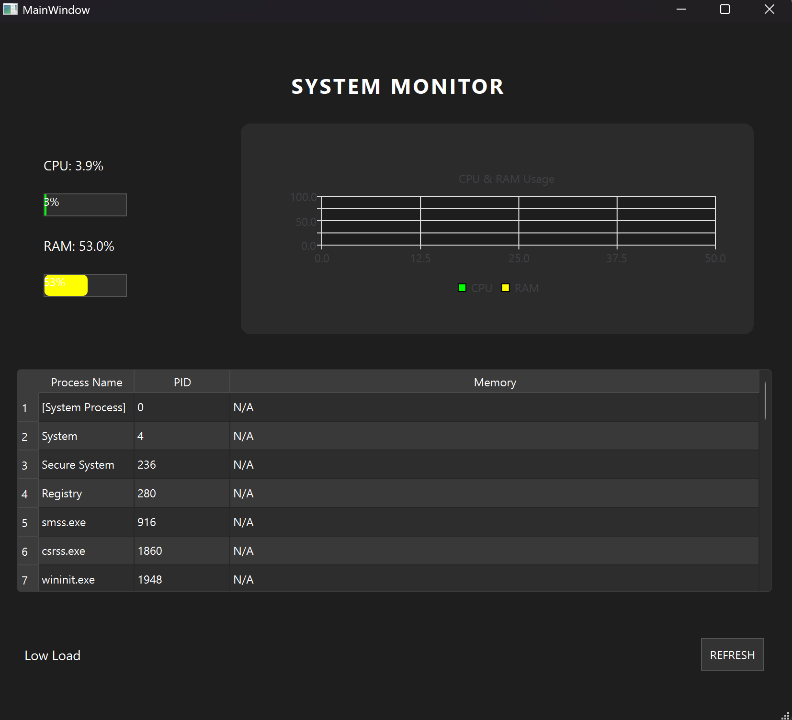

# 🖥️ System Monitor (Qt / C++)

A real-time system monitoring desktop application built using **C++ and Qt** that tracks CPU and RAM usage and displays running system processes using Windows APIs.

---

## 🚀 Features

* 📊 Real-time CPU usage monitoring
* 💾 Live RAM usage tracking
* 📈 Dynamic graph visualization using Qt Charts
* 📋 Process listing using Windows API
* 🧠 Memory usage per process
* 🔄 Auto-refresh using QTimer
* 🔍 Sorting support for process table

---

## 🛠️ Tech Stack

* **Language:** C++
* **Framework:** Qt (Qt Widgets + Qt Charts)
* **System APIs:** Windows API (ToolHelp32 + PSAPI)

---

## 📸 Screenshot



---

## ▶️ How to Run

1. Clone the repository:

   ```bash
   git clone https://github.com/Vishalayya/system-monitor-qt.git
   ```

2. Open the project in **Qt Creator**

3. Select a kit (MinGW / MSVC)

4. Build and Run

---

## 💡 What I Learned

* Interfacing C++ applications with Windows system APIs
* Real-time data visualization using Qt Charts
* Managing UI updates efficiently using QTimer
* Working with system-level process data (PID, memory usage)

---

## 📌 Future Improvements

* Add CPU usage per process
* Add search and filter for processes
* Improve UI (Task Manager-like design)
* Add cross-platform support (Linux/macOS)

---
